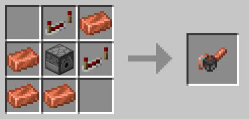
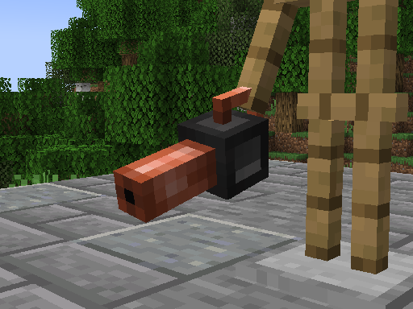

# The Shuffle Cannon

## Click. Shuffle Build.

 

 The Shuffle Cannon introduces a powerful new tool for builders who love variety and randomness!  

 With the Shuffle Cannon, you can select a set of blocks and place them randomly with a single click, 
making it easier than ever to create textured builds, natural landscapes, or chaotic designs.

## Downloads

- [Direct download](https://github.com/DiegoRevenga/the-shuffle-cannon/releases/download/1.0.0%2B1.21/the_shuffle_cannon-1.0.0.jar)
- [Modrinth](https://modrinth.com/mod/the-shuffle-cannon)

## Showcase

### Placing random blocks

### Shuffle Cannon GUI
This menu lets you choose which blocks will the Shuffle Cannon shoot and adjust their frequency.

### Recipe

### 3D Model

